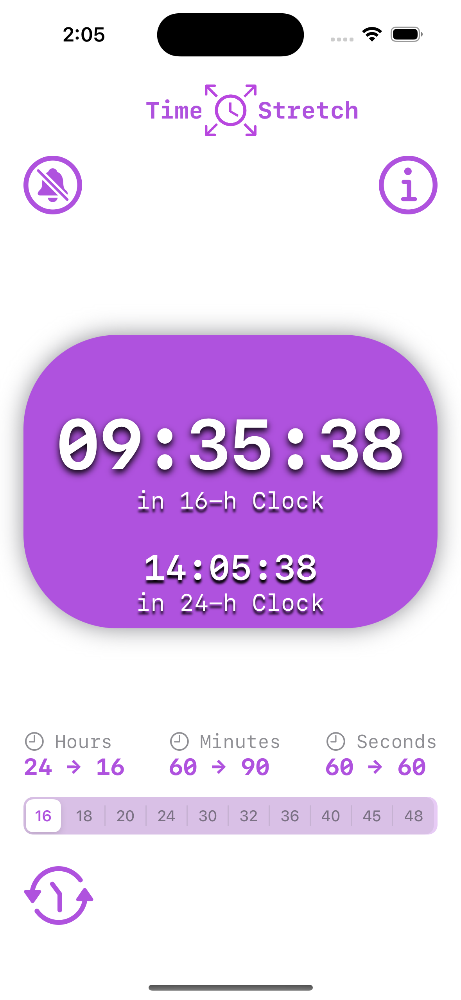
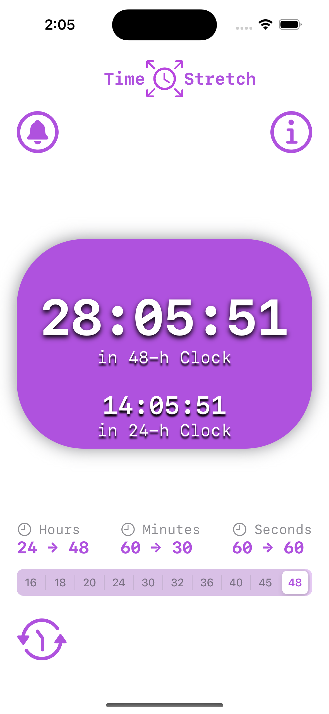
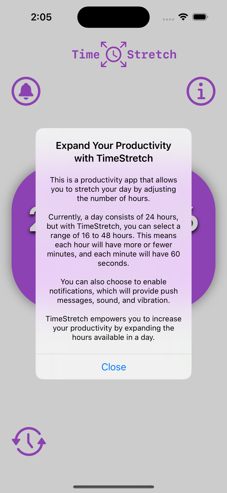
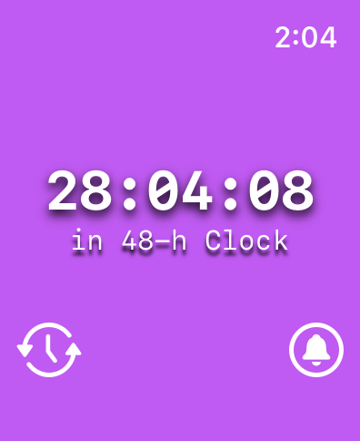
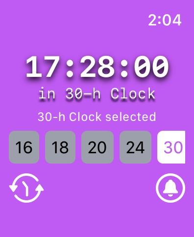
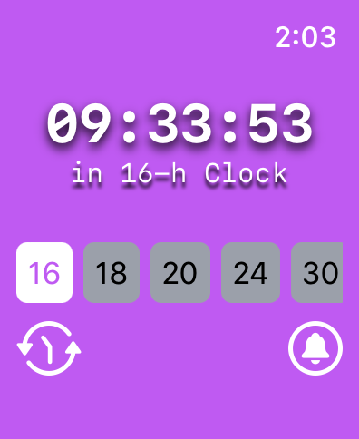

# TimeStretch: Expand Your Day

TimeStretch is a productivity app that allows you to stretch your day by adjusting the number of hours.

Currently, a day consists of 24 hours, but with TimeStretch, you can select a range of 16 to 48 hours. This means each hour will have more or fewer minutes, and each minute will have 60 seconds.

You can also choose to enable notifications, which will provide push messages, sound, and vibration.

TimeStretch empowers you to increase your productivity by expanding the hours available in a day.

## Features

- **Flexible Time Systems**: Easily switch between different time systems to match your preferences and needs.
- **Custom Hourly Notifications**: Set personalized notifications to stay on track throughout the day.
- **Intuitive Interface**: Enjoy a user-friendly and visually appealing interface for both iPhone and Apple Watch.
- **Apple Watch Support**: Experience time management at a glance with our Apple Watch companion app.
- **Adaptive Time**: Make time work for you by adjusting it to your lifestyle and routines.

## Screenshots

### iPhone

  

### Apple Watch

  

## Getting Started

To get started with TimeStretch, follow these simple steps:

1. Download TimeStretch from the App Store on your iPhone.
2. Open the app and explore the various time systems available.
3. Customize your experience by setting up custom hourly notifications.
4. Enjoy a more flexible and productive approach to time management!

## Requirements

- iOS device running iOS 15.00 or later.
